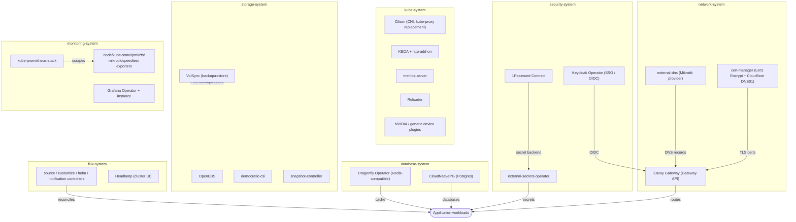
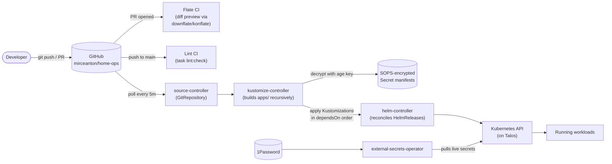
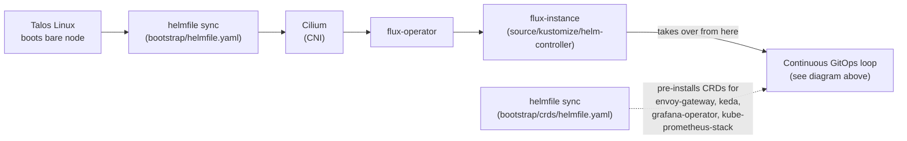

<div align="center">

# HomeOps


GitOps repository for my homelab Kubernetes cluster, a bare-metal [Talos Linux](https://www.talos.dev/) cluster reconciled continuously by [Flux](https://fluxcd.io/).

</div>

## 🎯 Scope

This repo holds everything running on my homelab Kubernetes cluster:

- **OS & node config**: [Talos Linux](https://www.talos.dev/) machine
  configuration, patches, and system extensions (`talos/`).
- **Cluster bootstrap**: the minimal, one-time `helmfile` bootstrap that
  gets Flux running (`bootstrap/`).
- **Platform components**: CNI, ingress, DNS, TLS, secrets, storage,
  databases, and observability (`apps/*-system/`).
- **Application workloads**: everything from AI/LLM tooling to media,
  home automation, games, and productivity apps (`apps/<domain>/`).
- **Reusable building blocks**: Kustomize components for common patterns
  like Postgres, Redis-compatible caches, backups, and OIDC clients
  (`components/`).

## 📁 Repository Structure

```text
home-ops/
├── talos/               # Talos machine config (talconfig.yaml + patches/)
├── bootstrap/           # One-shot Helmfile: Cilium + Flux operator/instance, CRDs
├── apps/
│   ├── flux-system/     # Flux itself, Headlamp (cluster UI), MCP servers
│   ├── kube-system/     # Cilium, KEDA, metrics-server, device plugins, Reloader
│   ├── network-system/  # Envoy Gateway, cert-manager, external-dns
│   ├── security-system/ # External Secrets Operator, 1Password Connect, Keycloak
│   ├── storage-system/  # OpenEBS, democratic-csi, VolSync, snapshot-controller
│   ├── database-system/ # CloudNativePG (Postgres), Dragonfly (Redis-compatible)
│   ├── monitoring-system/ # kube-prometheus-stack, Grafana, exporters
│   └── <domain>/        # Application workloads: ai, media, downloads, games,
│                         # home-automation, productivity, finance, tools, …
├── components/           # Reusable Kustomize components (cnpg, dragonfly,
│                         # volsync, keycloak-client, oidc, nfs-scaler)
├── .taskfiles/            # Task definitions (cluster, lint, sops, volsync)
├── .scripts/              # Operational scripts (SOPS, VolSync backup/restore)
├── .renovate/             # Renovate config (grouping, automerge, versioning)
└── .agents/skills/         # Runbooks for common operational tasks
```

Each app follows the same pattern: an `app.ks.yaml` (Flux `Kustomization`, declaring `dependsOn` and any shared `components/`) pointing at an `app/` directory containing the `HelmRelease`/manifests and a `kustomization.yaml`.

## 🛠 Core Tools

| Category               | Tool                                                                                                                           | Purpose                                                                          |
| ---------------------- | ------------------------------------------------------------------------------------------------------------------------------ | -------------------------------------------------------------------------------- |
| **OS**                 | [Talos Linux](https://www.talos.dev/)                                                                                          | Immutable, API-managed, minimal Kubernetes OS                                    |
| **Node config**        | [talhelper](https://github.com/budimanjojo/talhelper) / `talosctl`                                                             | Generates & applies Talos machine configs from `talconfig.yaml`                  |
| **GitOps engine**      | [Flux](https://fluxcd.io/) (via [flux-operator](https://github.com/controlplaneio-fluxcd/flux-operator))                       | Continuously reconciles the cluster against this repo                            |
| **Bootstrap**          | [Helmfile](https://helmfile.readthedocs.io/)                                                                                   | One-shot install of Cilium + Flux to break the chicken-and-egg bootstrap problem |
| **Package manager**    | [Helm](https://helm.sh/) (via Flux `HelmRelease`)                                                                              | Templating & lifecycle for every platform/app chart                              |
| **Manifest layering**  | [Kustomize](https://kustomize.io/)                                                                                             | Composes/patches manifests per app, reused via shared `components/`              |
| **Secrets at rest**    | [SOPS](https://github.com/getsops/sops) + [age](https://github.com/FiloSottile/age)                                            | Encrypts secrets committed to git; decrypted in-cluster by Flux                  |
| **Secrets at runtime** | [External Secrets Operator](https://external-secrets.io/) + [1Password Connect](https://developer.1password.com/docs/connect/) | Syncs live secrets from 1Password into the cluster                               |
| **Tool versioning**    | [mise](https://mise.jdx.dev/)                                                                                                  | Pins every CLI (`kubectl`, `flux`, `helm`, `talosctl`, `sops`, …)                |
| **Task runner**        | [Task](https://taskfile.dev/)                                                                                                  | `task lint`, `task sops:*`, `task volsync:*`, `task cluster:*`                   |
| **Dependency updates** | [Renovate](https://docs.renovatebot.com/)                                                                                      | Automated PRs for chart/image/tool version bumps                                 |
| **CI**                 | GitHub Actions                                                                                                                 | Lints every push; renders a manifest diff preview on every PR                    |

## ☸️ Core Kubernetes Components

Platform components are grouped into dedicated namespaces (`*-system`),
separate from application workload namespaces (`ai`, `media`, `default`, …).



| Namespace           | Component(s)                                                          | Role                                                                |
| ------------------- | --------------------------------------------------------------------- | ------------------------------------------------------------------- |
| `flux-system`       | Flux operator/instance, Headlamp                                      | GitOps engine + web UI for the cluster                              |
| `kube-system`       | Cilium, KEDA, metrics-server, Reloader, NVIDIA/generic device plugins | CNI (kube-proxy-less), autoscaling, GPU passthrough, config reloads |
| `network-system`    | Envoy Gateway, cert-manager, external-dns                             | Ingress (Gateway API), TLS certificates, DNS record management      |
| `security-system`   | External Secrets Operator, 1Password Connect, Keycloak Operator       | Secret injection and cluster-wide SSO/OIDC                          |
| `storage-system`    | OpenEBS, democratic-csi, snapshot-controller, VolSync                 | Local + NFS/iSCSI (ZFS-backed) storage, snapshots, backup/restore   |
| `database-system`   | CloudNativePG, Dragonfly Operator                                     | Managed Postgres and Redis-compatible instances for apps            |
| `monitoring-system` | kube-prometheus-stack, Grafana Operator, exporters                    | Metrics, dashboards, alerting for cluster + hardware                |

## 🔄 GitOps Logic Flow



The **Bootstrap** process (only needed once, or after a full rebuild) breaks two chicken-and-egg problems:

1. "Flux needs a CNI, the CNI needs Flux",
2. Installs some core CRDs such as the Gateway API and Kube-Prometheus-Stack CRDs to avoid deadlocks



## ⭐ Stargazers

<div align="center">
    <a href="https://star-history.com/#mirceanton/home-ops&Date">
        
    </a>
</div>

## 🤝 Gratitude and Thanks

There is a template over at [onedr0p/flux-cluster-template](https://github.com/onedr0p/flux-cluster-template).

Thanks to all the people who donate their time to the [Home Operations](https://discord.gg/home-operations) Discord community. Be sure to check out [kubesearch.dev](https://kubesearch.dev/) for ideas on how to deploy applications or get ideas on what you could deploy.

## 📜 Changelog

See my _awful_ [commit history](https://github.com/mirceanton/home-ops/commits/main)
